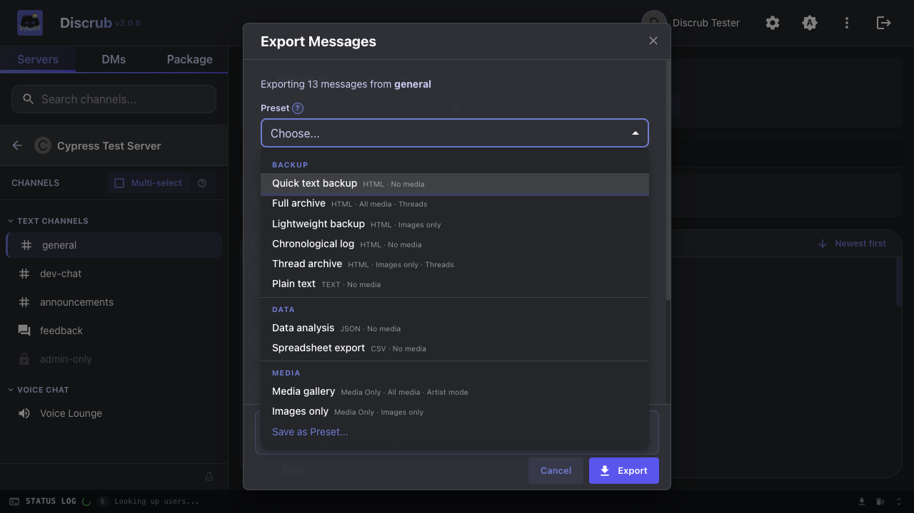
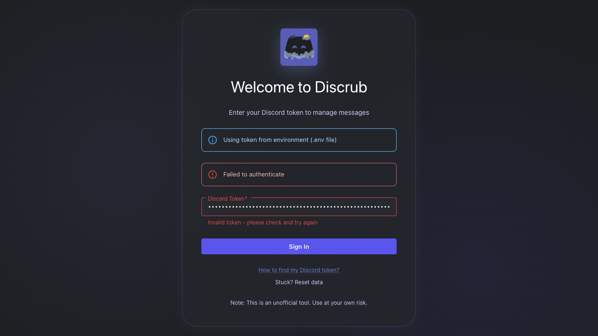
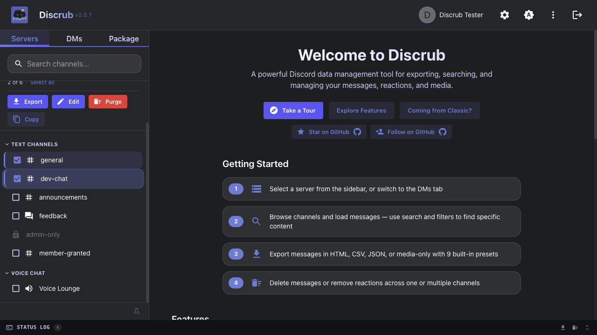

# Upgrading from Discrub Classic

Welcome! If you're coming from Discrub Classic, this guide covers everything that's new, what's changed, and how to get the most out of the new version.

---

## Table of Contents

- [What's New](#whats-new)
  - [Major New Features](#major-new-features)
  - [Export Improvements](#export-improvements)
  - [Purge Improvements](#purge-improvements)
  - [Search Improvements](#search-improvements)
- [What's Changed](#whats-changed)
  - [Authentication](#authentication)
  - [Navigation](#navigation)
  - [Settings](#settings)
  - ["Other Files" Media Type](#other-files-media-type)
  - [Operations](#operations)
- [Quick Start for Discrub Classic Users](#quick-start-for-discrub-classic-users)
- [Still Prefer Discrub Classic?](#still-prefer-discrub-classic)

---

## What's New

Discrub 2.0 is the next major version of Discrub. Here's what you get that Discrub Classic didn't have:

### Major New Features

- **Discord-Style Chunked Feed**: Messages render inline in a Discord-style chunked feed with hover-only gutter timestamps, virtualization for smooth scroll on huge channels, and inline content rendering (no separate Preview modal needed).
- **System Messages**: Pinned, joined, boosted, thread-created and other Discord system events render properly as compact native-style notices instead of blank rows.
- **Click-to-Jump Navigation**: Click any reply bar, pinned-message notice, or thread-created notice to jump to the referenced message. The target row briefly flashes amber.
- **Inline Filter-by-User**: Click any author's avatar or name to open their profile, then one-click to filter the channel to messages by them or messages mentioning them. Other active filters preserved.
- **Focus Mode**: Distraction-free reading mode that hides the sidebar and status panel for a full-width feed. Press `F` to toggle, `Escape` to exit.
- **Two-Layer Filter Modal**: Search hits Discord's API; Refine narrows already-loaded messages client-side. Date filters support **time-of-day precision** (hour and minute, not just whole days) and now also a **between two dates** range (combine Before and After together). Search results stream in lazily with a live "X of Y matches loaded" counter; Load All renders matches as pages arrive and retries transient network failures automatically.
- **Tour Mode + Targeted Help**: A guided tour runs once for new users covering the major features. For day-to-day "what does this do?" moments, small `?` help icons sit next to the trickier affordances (multi-select, filters, focus, purge mode, pause/resume, operation delays, export presets, etc.) and open a one-paragraph explainer on click.
- **Stale-Feed Reload Toast**: After a purge that targets the channel you're viewing, a one-click toast offers to reload the feed so you see Discord's post-purge state instead of the cached snapshot.
- **Discord Layout HTML Exports**: Exported HTML wraps in a Discord-like shell with server sidebar, channel navigation, and theme toggle. Browse between channels within a single export file.
- **Data Package Import & Rehydration**: Import Discord's "Request All of My Data" ZIP to browse, analyze, and re-export your entire message history, including servers you've left. The importer handles large packages (multi-gigabyte, ZIP64-encoded archives that previously failed to open) and packages exported in any Discord locale (French, German, Spanish, Simplified Chinese, Cyrillic, etc.). Multi-attachment messages render every attachment, not just the first. Imports decompress once into IndexedDB and per-channel reads come straight from IDB; reload the page and the package auto-resumes without re-import. A Filter button on the package message table opens a focused modal with Content and Date controls so you can narrow the list without touching the network, and exports honor whatever filter is currently active. Per-channel Tier 2 rehydration fetches live reactions, mentions, embeds, and fresh CDN URLs so old exports match the live app, with an estimated runtime shown before you commit and a guild-wide search preflight that covers most messages in a single pass; once enriched, clicking any reaction chip opens the live ReactionModal so you can see who reacted.
- **Forum Channel Support**: Full support for Discord forum and media channels. Browse active and archived threads, load thread messages, and export them individually.
- **Voice and Stage Channel Chat**: The persistent text chat embedded in voice and stage channels (rolled out by Discord in 2021) is now browsable, exportable, and purgeable just like any text channel.
- **Thread Discoverability**: The Load Thread modal auto-discovers active and archived threads in the current channel and renders a clickable list. Threads whose starter message has been deleted are still reachable, no thread ID hunting required.
- **Bulk Reaction Removal & Addition**: Remove reactions across multiple messages at once with emoji picker and user targeting (admins get one-click bulk removal), or **add** one or more emoji to every selected message in a single paced, cancelable run.
- **Bulk Edit Across Channels**: Overwrite your own messages across multiple selected channels or DMs at once (handy for scrubbing content before a delete), with pause/cancel and per-channel progress.
- **Rich Stickers & Polls**: Sticker-only and poll-only messages render as their actual sticker image and a poll vote-bar card, in both the feed and HTML exports, instead of showing "(no content)".
- **Analytics Modal**: Nine ranked reports on the loaded messages (most active members, most mentioned, most reacted, keywords, linked domains, and more), each with a chart and CSV export.
- **10 Export Presets**: Quick Text Backup, Full Archive, Data Analysis, Spreadsheet Export, Media Gallery, Lightweight Backup, Chronological Log, Images Only, Thread Archive, Plain Text. Plus custom preset creation.
- **Themes**: A theme picker in Settings with live preview. Six free themes (Dark Original, Light Original, Terminal, High Contrast, Overcast, Classic); supporters unlock eight more cosmetic themes plus export theming and a custom export footer via a key emailed from Ko-fi. All features stay free.
- **Donation Wall**: Ko-Fi supporter feed with tier system and leaderboard.
- **Role Colors & Icons**: Author names colored by their highest role, with role icons displayed in the feed and user profiles.
- **Reply Indicators**: Messages that are replies show the referenced message author and a preview of what they replied to. Click the reply bar to jump to the original.
- **Channel Categories**: Channels grouped by Discord categories with collapsible headers.
- **Permission-Based Visibility**: Locked channels shown with lock icons, admin features gated by Manage Messages permission.
- **Status Log**: Terminal-style real-time operation log with color-coded entries, downloadable as a `.log` file. The panel is resizable (drag the top edge), persists history across sessions, and groups entries by session for easy review.
- **Range Selection**: Shift+Click selects a range in the server, channel, and DM lists. In the message feed, click a checkbox and drag to sweep a range of messages, with edge auto-scroll and thread-tab support.
- **Group DM Distinction**: Group DMs carry a Group chip, show the group's own name when one is set, and are labeled as groups in purge confirmations.
- **Open DM by ID**: Paste a DM channel ID or a user ID to open conversations Discord no longer lists, including closed DMs and DMs with deleted accounts, keeping their history exportable and purgeable.
- **Skeleton Loading**: Smooth placeholder loading states instead of blank screens.
- **Error Recovery**: Persistent error logging with crash recovery and downloadable error reports.

### Export Improvements

| Feature | Discrub Classic | Discrub |
|---------|------------|---------|
| HTML Templates | Standard only | Standard + Discord Layout (default) |
| Export Presets | None | 10 built-in + custom |
| Formats | HTML | HTML, Plain Text, CSV, JSON, Media Only |
| Plain Text Knobs | No | Configurable attachment style, reactions, replies, and bot indicator |
| Large HTML Exports | Could crash at ~thousands of messages | Streamed in chunks so multi-thousand-message channels finish reliably |
| Oversized Exports | Single archive, could corrupt past 4 GB | Auto-split into `export.zip`, `export-part2.zip`, ... under a safe size |
| Forwarded Media | Not exported (blank links offline) | Forwarded attachments and embedded images downloaded and rewritten to local copies |
| Stickers & Polls | Not rendered | Sticker images and poll cards rendered in HTML exports |
| Bare Image/GIF Links | Exported as plain URLs | Rendered as inline media, matching how Discord displays them |
| Preset Date Range | Re-enter each time | Saved presets can remember an optional date range |
| Thread Filenames | Last write wins on collision | Auto dedupe (`_<threadId>` suffix) so duplicate-named threads keep separate files |
| Media Breakdown | None | Per-type counts and sizes with preview |
| Media File Dates | Downloaded files carried the message's date | Same behavior, restored: media files are stamped with the original message date |
| Failing Message Mid-Export | Could abort the whole run | Placeholder row + warning with the message ID; the export keeps going |
| Dropped Connection Mid-Export | Ended that channel's export | Page fetch retried with backoff; if the network stays down the export pauses so you can Resume from the same page |
| Slow Media Downloads | Flat timeout could cut off large files | Aborts only on a true stall, so slow connections finish large attachments |
| Forum Channels in Bulk Export | N/A | Forums expand into their posts automatically, grouped under the forum's name in the shell |
| README in Export | No | Yes. Bundled guide explaining file structure |
| Role Colors in HTML | Basic | Enhanced with role icon support next to author names |
| Reply Bars in HTML | Basic | Enhanced with formatted content preview |

### Purge Improvements

| Feature | Discrub Classic | Discrub |
|---------|------------|---------|
| Clear All Reactions (admin) | No | Yes (one API call per message) |
| `reaction.me` Optimization | No | Skips emojis user hasn't reacted to |
| Batch Reaction Removal | No | Remove reactions across selected messages with emoji picker |
| Strip Attachments Only | No | Edits messages to remove attachments without deleting text (own messages) |
| Bulk Filters | No | Filter bulk purge by author, date range, content, has-types, mentions |
| Archived Thread Handling | Skip with warning | Auto-unarchive → operate → restore archive state, or opt to skip archived threads entirely with "Don't wake archived threads" |
| Preserve Files & Links | No | "Keep messages with files or links" deletes only plain-text chatter, preserving anything with an attachment or link |
| Stale-Feed Reload Toast | No | One-click reload after a purge targets the visible channel |
| Pinned Message Preservation | No | Setting the FilterModal Pinned dropdown to "False" actually preserves pinned messages, with the count reported in the status log |
| Progress Visibility | Static counter | Status log progress label pulses on each update with adaptive milestones (5 / 25 / 100) so progress is always obvious |
| Deleted Accounts | Search finds nothing, so nothing is purged | Detects the empty search, warns you, and falls back to a full message-history scan so a deleted user's messages are still removed |
| Dropped Connection Mid-Scan | Scan ended quietly | Page fetch retried with backoff; a scan that still can't continue is reported as incomplete instead of finishing silently |

### Search Improvements

| Feature | Discrub Classic | Discrub |
|---------|------------|---------|
| Progress Feedback | Basic | Milestone-based status log entries with operation tracking |
| Client-Side Filter | Basic | Full criteria support with mode indicator |
| Two-Layer Model | Single layer | Search (Discord API) + Refine (client-side, no API) in one modal |
| Content Terms | One term | Several terms matched any-of, in both Search (one Discord search per term, merged) and Refine |
| Attachment Filters | No | Filter by attachment file type and file name, server-side in Search and locally in Refine |
| Date Precision | Whole days | Hour and minute (time-of-day), with Before, After, or Between two dates |
| Pagination | All-at-once | Lazy 25-msg pages with "X of Y matches loaded" counter; Load All renders pages live and retries transient network failures |
| Inline Filter-by-User | No | Click an author → one-click filter by them or messages mentioning them |
| Filter Lifetime | Criteria persisted across channel switches | Cleared automatically when you switch conversations, so no stale filters |
| Indexing Notice | No | Warns when Discord reports a channel's search index is still being built, so partial results aren't mistaken for missing messages |

---

## What's Changed

### Authentication

- **Discrub Classic:** Auto-retrieves your Discord token from the Discord page (extension runs on discord.com)
- **Discrub (Web App):** You manually enter your Discord token on the landing page
- **Discrub (Extension):** Auto-retrieves your token like Classic. When you first launch, a **splash screen** lets you choose between Discrub 2.0 and Discrub Classic; your choice is remembered for future sessions.

Your token is stored in memory only and cleared when you close the tab, unless you tick **Keep me logged in** on the web app's landing page. That saves it as plain text in the browser's site data for that origin until you log out. Either way it never touches a server.

### Navigation

The layout is similar to Discrub Classic but enhanced:
- Server list on the left (same), now with multi-select and a Copy button for bulk grabbing server names or IDs
- Channel list with category grouping (new; Discrub Classic showed a flat list)
- Voice and Stage channels appear as first-class clickable rows (their persistent text chat is browsable just like any text channel)
- DMs accessible via tab switch (same)
- Multi-select mode for bulk operations (toggle button instead of separate toolbar)

### Settings

Settings location has moved:
- **Discrub Classic:** Settings were in the extension popup or inline panels
- **Discrub:** Settings are in a gear icon in the top bar, organized across tabs (Display, Operation Delays, Export Preferences, Purge)

All settings from Discrub Classic have been migrated. New settings include:
- Date/time format customization
- Operation delays up to 30 seconds, with a Safest zone above 10 seconds for very long runs
- User data refresh rate
- Export template selection
- Export preset management

### "Other Files" Media Type

In Discrub Classic, you could download all attachment types including PDFs, ZIPs, and documents. In the web app version, the "Other files" toggle is hidden because browser CORS restrictions prevent downloading non-media files from Discord's CDN.

**In extension mode**, "Other files" is available; the extension bypasses CORS restrictions.

### Operations

All operations now show in the status log at the bottom of the screen (instead of inline progress bars). The status log provides:
- Color-coded entries with timestamps
- Pause/resume/cancel controls in the status bar
- Downloadable log file for debugging

---

## Quick Start for Discrub Classic Users

1. **Get your token**: If using the web app, open Discord in your browser, press F12 to open DevTools, go to the Network tab, click any request to discord.com/api, and copy the `Authorization` header value. If using the extension, it auto-authenticates.

2. **Navigate**: Same as before: pick a server, pick a channel, messages load. New: you'll see channel categories and lock icons on channels you can't access.

3. **Export**: Click the Export button. The dialog has more options now but defaults are sensible. The new default template is "Discord Layout" which makes exported HTML look like Discord. Try it!

4. **Purge**: Enter multi-select mode (toggle button on the channel list header), select channels, click the purge icon. The dialog now supports Messages, Reactions, and Clear All Reactions modes.

5. **Search**: Click "Advanced Search & Filters" above the message table. Works the same as before but with more criteria options and automatic continuation past 5,000 results.

---

## Still Prefer Discrub Classic?

Discrub Classic is **built into the extension**: no separate install needed. When you launch Discrub on discord.com, the splash screen lets you choose between Discrub 2.0 and Discrub Classic. Your preference is saved automatically.

If you want the standalone legacy extension instead, you can download it from the [releases page](https://github.com/pratherbytecraft/discrub-ext/releases) and load it manually in your browser.
