# Discrub

A powerful Discord data management tool for exporting, searching, and managing your Discord messages, reactions, and media.

Available as a **web app** (manual token entry) and a **Chrome/Firefox extension** (auto-authentication on Discord).

**Official extension listings** (fake replicas exist on extension stores; these two URLs are the only genuine distributions, also listed in [SECURITY.md](SECURITY.md)):

- Chrome Web Store: <https://chromewebstore.google.com/detail/plhdclenpaecffbcefjmpkkbdpkmhhbj>
- Firefox Add-ons: <https://addons.mozilla.org/firefox/addon/discrub/>

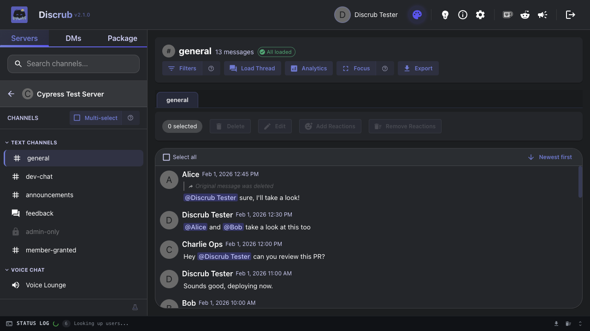

---

## Table of Contents

- [Features](#features)
  - [Browse Servers, Channels & DMs](#browse-servers-channels--dms)
  - [Message Feed, Search & Filters](#message-feed-search--filters)
  - [User Profiles & Quick Filters](#user-profiles--quick-filters)
  - [Click-to-Jump Navigation](#click-to-jump-navigation)
  - [Focus Mode](#focus-mode)
  - [Tour Mode & Targeted Help](#tour-mode--targeted-help)
  - [Export](#export)
  - [Purge](#purge)
  - [Reactions](#reactions)
  - [Message Operations](#message-operations)
  - [Forum Channels](#forum-channels)
  - [Analytics](#analytics)
  - [Data Package Import & Rehydration](#data-package-import--rehydration)
  - [Settings & Preferences](#settings--preferences)
  - [Status Log](#status-log)
  - [Pause, Resume & Cancel](#pause-resume--cancel)
  - [Themes](#themes)
  - [Additional Features](#additional-features)
- [Web App vs Extension](#web-app-vs-extension)
- [Getting Started](#getting-started)
- [Upgrading from Discrub Classic](#upgrading-from-discrub-classic)
- [Development](#development)
- [FAQ](#faq)
- [Tech Stack](#tech-stack)
- [Security](#security)

---

## Features

### Browse Servers, Channels & DMs

Navigate your Discord servers with full channel category support, permission-based visibility (locked channels shown with lock icons; channels you can reach only through a member-specific permission grant, such as ticket channels, are correctly shown as open), and direct message browsing with display names. Voice and Stage channels are first-class clickable rows since Discord rolled out persistent text chat in voice channels: select one to read its embedded message history just like any text channel.

Multi-select mode is available across the Server, Channel, and DM lists, with a styled Copy button for quickly grabbing names or IDs. Shift+Click selects a whole range at once. Server multi-select lays groundwork for future cross-server bulk operations.

Group DMs are visually distinct from one-on-one conversations: they carry a Group chip in the DM list, show the group's own name when one is set, and purge confirmations label them as groups so you always know how many people a bulk action touches.

Conversations Discord no longer lists can still be reached: **Open DM by ID** (in the DM list) accepts a DM channel ID or a user ID and opens the conversation directly, including closed DMs and DMs with deleted accounts, so their history stays exportable and purgeable.

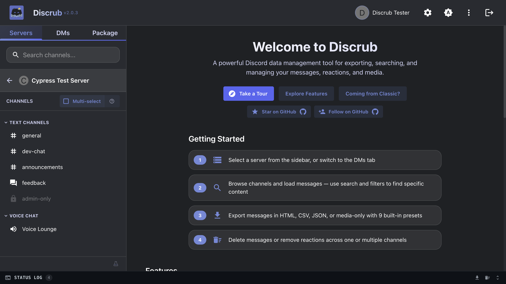
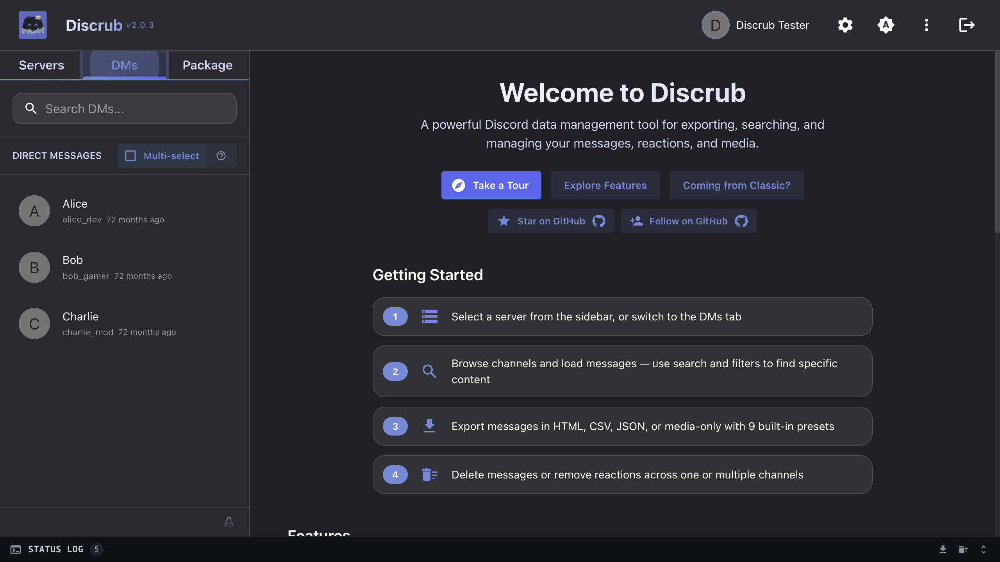

### Message Feed, Search & Filters

A Discord-style chunked feed with inline message rendering, role-colored author names, role icons, reply indicators, hover-only gutter timestamps, virtualization for smooth scroll on huge channels, and system messages (pins, joins, boosts, thread-created) rendered as compact native-looking notices. Stickers render as images and polls as vote-bar cards. Forwarded messages render their full snapshot content (text, attachments, embeds), and system and pinned messages are selectable for bulk actions. Bare image and GIF links that Discord shows as inline media render the same way in the feed and in HTML exports, instead of appearing as plain URLs.

Selecting many messages is fast: click a checkbox and drag to sweep a range (the feed auto-scrolls when you reach the edge), or use Shift+Click to extend a selection. Both work in thread tabs too.

**Filters** uses a two-layer model in one modal:

- **Search** hits Discord's API. Filter by message content (one term, or several matched any-of: type a term and press Enter, or add more with commas), author, mentions, has-types (image, video, link, file, embed, sound, sticker, snapshot, poll, forward), attachment file type (png, pdf, any list of extensions) and exact attachment file name, date range (before, after, or between two dates) with **time-of-day precision**, pinned status, and author type (human / bot / webhook). Results stream in lazily as the channel header shows `X of Y matches loaded` and a Load All option transparently chains queries past Discord's 5,000-result cap. Load All renders messages live as pages arrive (no more waiting for the full run to finish before anything appears), retries transient network failures with exponential backoff, and pauses if retries exhaust so you can resume after fixing the network. If Discord reports that a channel's search index is still being built, Discrub says so up front, since results can look incomplete until Discord finishes indexing.

Search and Refine criteria are cleared automatically when you switch to a different channel or DM, so a filter from one conversation never silently narrows another.
- **Refine** narrows the messages already loaded, client-side, with no API calls. Content terms work the same way here, any-of. Survives "Load more" so new pages stay filtered, and a status entry appears when an incoming page contributed zero matches. Includes a system-message control to **show only** or **hide** a chosen system-message type (pins, joins, boosts, etc.), plus attachment file type and a partial file-name match for the messages already on screen.

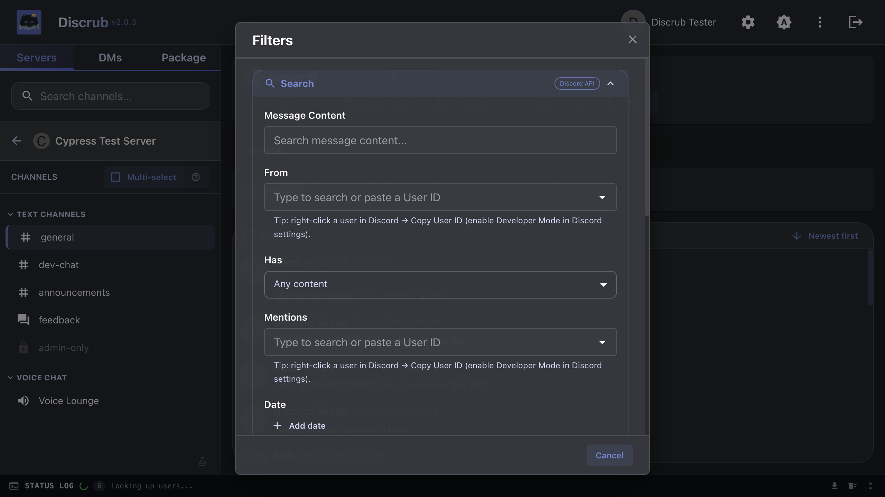

### User Profiles & Quick Filters

Click any avatar or username to view a Discord-style profile card with display names, server nicknames, role colors, role list with icons, badges, account details, and profile customization info.

The profile modal also exposes two **one-click filter shortcuts**:
- **Filter messages by [name]**: narrows the channel to messages they authored
- **Filter messages mentioning [name]**: narrows to messages where they're @mentioned

Other active filters (date, content, etc.) are preserved when you apply either; only the user scope changes.

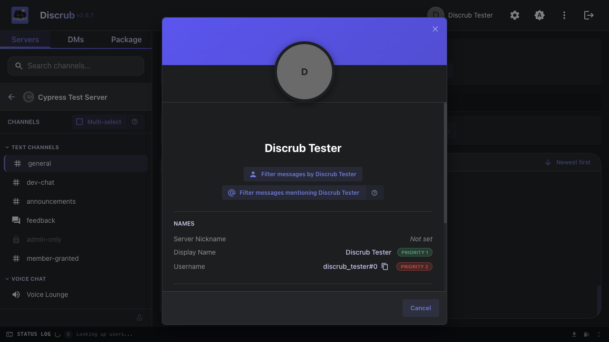

### Click-to-Jump Navigation

Click any **reply bar**, **pinned-message notice**, or **thread-created notice** in the feed to jump to the referenced message. The target row briefly flashes amber so your eye lands on it. Works for any message that's currently loaded; out-of-view targets show a brief toast prompting you to load more first.

### Focus Mode

Distraction-free reading mode that hides the sidebar and status panel for a full-width feed. Press `F` to toggle, `Escape` to exit. Available from a Focus button in the channel toolbar.

### Tour Mode & Targeted Help

First-time users get a **guided tour** of the app: server browsing, multi-select, filters, exports, focus mode, and the message feed. Skippable, non-blocking, and tracked per-version (so future major changes can re-trigger the relevant steps without nagging users who've already seen them).

For day-to-day "what does this do?" moments, look for the small **`?` icons** placed next to the trickier affordances:
- Multi-select toggle (in channel and DM lists)
- Filters button + Refine section
- Profile quick-filter buttons
- Focus mode toggle
- Search match counter
- Purge mode toggle
- Pause / Resume controls
- Operation Delays setting
- Export preset dropdown

Click any `?` for a short paragraph explaining how the feature actually works, independent of the main tour and always available.

### Export

Export messages in five formats with granular control:

| Format | Description |
|--------|-------------|
| **HTML** | Styled webpage with avatars, formatting, reactions, role colors, and theme toggle |
| **Plain Text** | Lightweight `.txt` files with configurable attachment style, reactions, replies, and bot indicator. Suitable for archive, grep, or plain-editor review |
| **CSV** | Spreadsheet-compatible format |
| **JSON** | Raw data format for analysis |
| **Media Only** | Download attachments without message content |

**HTML Templates:**
- **Discord Layout** (default): wraps exports in a Discord-like shell with server sidebar, channel navigation grouped under your server's categories (just like Discord), and theme toggle
- **Standard**: clean standalone HTML pages

**Export Features:**
- 10 built-in presets (Quick Text Backup, Full Archive, Plain Text, Data Analysis, Media Gallery, etc.)
- Custom preset creation and management
- Per-type media selection (images, videos, audio)
- Configurable messages per page
- Thread/forum post separation into individual files, with automatic name-collision dedupe so threads that share a title don't overwrite each other (and the Discord Layout sidebar keeps those thread links clickable)
- Any remaining zip path collision is renamed on the fly instead of aborting the export, so one duplicate filename can't sink a long run
- Forwarded-message media (attachments and embedded images) is downloaded and rewritten to local copies, so forwarded content shows up offline instead of as blank links
- Stickers and polls render in HTML exports (sticker images, poll cards)
- Detailed reaction user data in HTML exports
- Media breakdown bar showing file counts and sizes
- Artist mode (organize media by author)
- Sort order (oldest/newest first)
- README.html (HTML/CSV/JSON/Media exports) or README.txt (Plain Text exports) bundled with every export explaining how to navigate the files
- Large HTML exports stream each page as separate chunks so multi-thousand-message channels no longer hit the V8 string-size cap mid-run
- If a single message fails to render, the export keeps going: the message gets a placeholder row (in every format) and a warning naming its ID, so one bad message can't sink a multi-hour run
- Media downloads abort only when they truly stall (no bytes arriving for a sustained period), so large attachments on slow connections finish instead of being cut off by a flat timeout
- Failed media downloads automatically retry on Discord's alternate CDN endpoint, with the HTTP status included in the warning (this also fixes WebP attachments silently failing to download)
- Downloaded media files are stamped with their message's original date as the file modified date, matching Discrub Classic behavior
- Group DM exports are foldered under the group's actual name, and orphaned GIF thumbnails no longer produce broken media entries
- Oversized exports split into multiple zip parts (`export.zip`, `export-part2.zip`, ...) under a safe size, so a single archive can't corrupt past the 4 GB / 65,535-entry limit
- Saved presets can remember an optional date range, so a recurring export doesn't need the dates re-entered each time
- A screen wake lock is held during long exports and purges, so the run doesn't stall when your display sleeps
- Operation pacing runs on a worker timer, so switching to another tab no longer slows a long purge or export to a crawl (browsers throttle ordinary timers in background tabs; keep the tab open, since tab-sleep or memory saver can still end a run early)

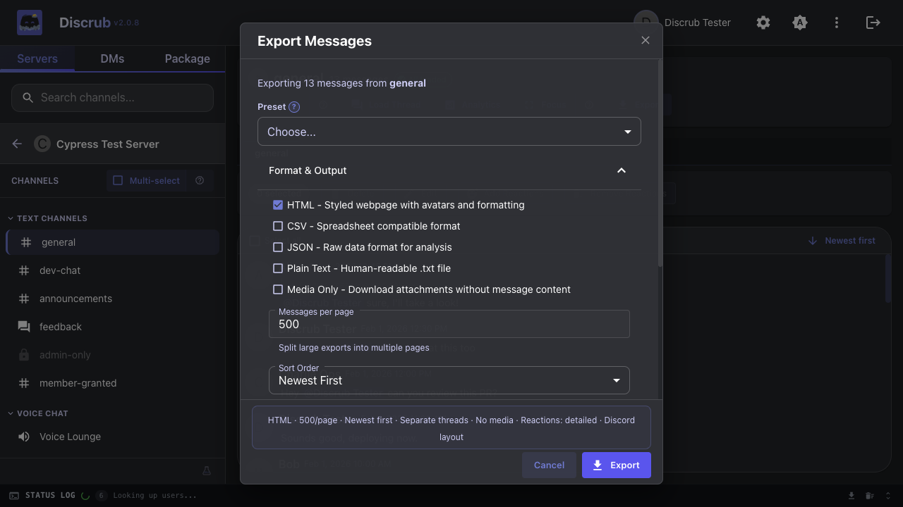
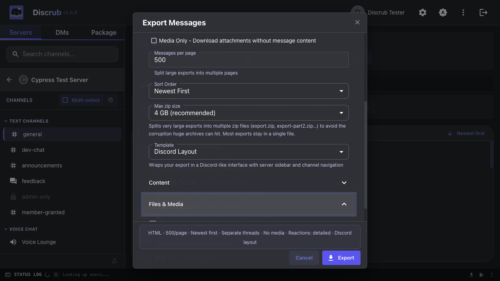

### Purge

Delete messages and reactions across one or multiple channels with user targeting:

- **Messages Mode**: search-based deletion with per-user targeting, with an optional **"Also delete system messages"** section to opt specific system-message categories (pins, joins, boosts, etc.) into the sweep alongside your matched messages
- **Attachments Only**: strip attachments from messages without deleting the text (own messages only, a Discord API limitation)
- **Reactions Mode**: remove specific users' reactions from all messages (your own without permission, any user with Manage Messages)
- **Clear All Reactions** (admin): bulk remove all reactions using a single API call per message

Features: multi-channel selection with one-click "Select all", filters integration (narrow by author, content, date, has-types) for both bulk export and bulk purge, retain-attachments option, thread-aware discovery (auto-unarchives during purge and re-archives when done), DM support (own messages only), pause/resume/cancel.

Two safeguard options let a purge leave things alone:

- **Don't wake archived threads** skips archived threads entirely instead of un-archiving them to purge inside (Discord requires un-archiving to delete, which makes old threads visibly reappear for other members). Skipped threads are counted loudly in the summary.
- **Keep messages with files or links** preserves any message carrying an attachment or a link, deleting only the plain-text chatter around them. Preserved counts appear in the purge summary.

Purging a **deleted account's** messages works even though Discord's search returns nothing for deleted users: Discrub detects the empty search, warns you, and falls back to a full message-history scan so those messages are still found and removed.

Setting the FilterModal's Pinned dropdown to **False** now actually preserves pinned messages during a purge. Discord's search endpoint silently ignores `pinned=false`, so Discrub applies the filter client-side as a final safety check before each delete and reports the count of preserved pinned messages in the status log.

While a purge runs, the status log's progress label pulses on each counter update with adaptive milestones (every 5 deletes early, then 25, then 100) so it's obvious the operation is making progress.

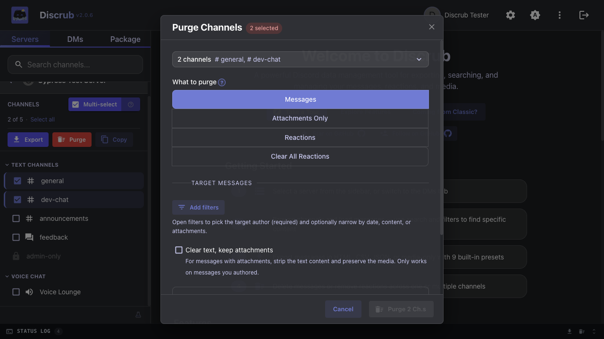

### Reactions

View who reacted to any message, with per-user reaction management:

- View reacting users with avatars
- Remove individual reactions (own reactions, or any with Manage Messages permission)
- Admin bulk removal: remove all reactions or all of a specific emoji in one API call
- Batch removal across selected messages with Discord-style emoji picker and user selection
- Batch **addition** across selected messages: pick one or more emoji (server custom emoji plus the full unicode set, or paste an emoji/shortcode) and apply them to every selected message, with a live "messages × emoji" count and paced, cancelable execution that buckets any failures (no permission, rate limited, message gone)
- `reaction.me` optimization: skips unnecessary API calls for emojis the user hasn't reacted to

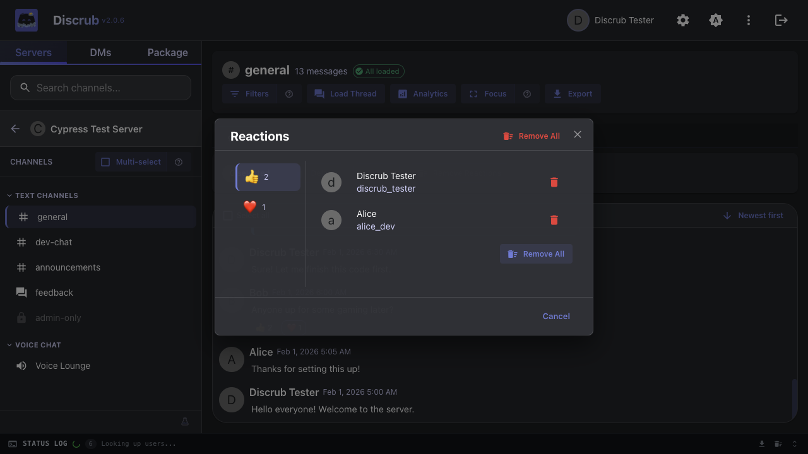

### Message Operations

- **Delete**: single or bulk message deletion with confirmation
- **Edit**: single or bulk message editing, including across multiple selected channels or DMs at once (your own messages only), with pause/cancel and per-channel progress
- **Attachment Management**: delete individual attachments or all from a message
- **Strip Attachments Only**: keep the message text but remove its attachments (own messages only, a Discord API limitation)
- **Remove Reactions**: batch removal from toolbar with emoji/user selection
- **Stale-feed reload toast**: after a purge that targets the channel you're currently viewing, a one-click toast offers to reload the feed so you see Discord's post-purge state instead of the cached snapshot

### Forum Channels

Full support for forum/media channels (Discord channel types 15 and 16):

- Browse forum threads/posts with preview cards
- Search threads by name
- Load thread messages into the message table
- Export forum threads individually or as part of bulk exports
- Discovers active and archived threads (public and private), so freshly-active posts show up alongside the archive
- Bulk exports expand forum channels into their posts automatically: every post is exported as its own unit and the Discord Layout shell groups them under the forum's name, so selecting a forum in a bulk export actually captures its content

The **Load Thread** modal now auto-discovers active and archived threads in the current channel and renders a clickable list (name, member and message counts, and an Archived chip with when it was archived), so threads whose starter message has been deleted are still reachable without having to copy a thread ID by hand. The manual ID input remains as a fallback for power users.

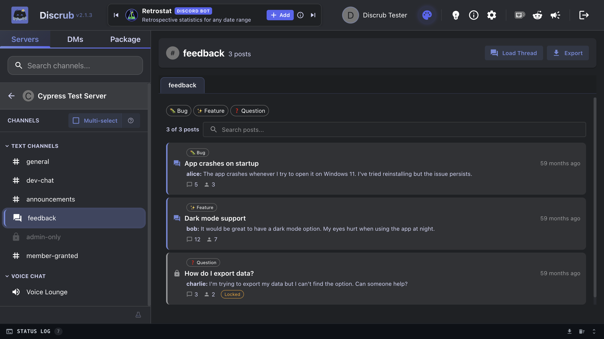

### Analytics

Nine reports over whatever messages you have loaded: Overview (the headline numbers, Wrapped-style), Most mentioned, Most active members, Most reactions received, Most reacted messages, Most active threads, Keyword mentions, Most linked domains, and Most attachments shared. Every ranked report has a chart and a CSV export, and a "Skip Replies" option excludes reply mentions from mention counts.

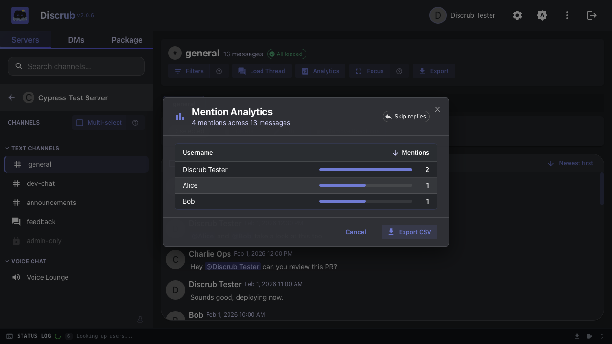

### Data Package Import & Rehydration

Import the ZIP from Discord's "Request All of My Data" export and browse, analyze, bulk-edit, bulk-delete, or re-export your full message history, including servers you've left. Processing happens entirely in your browser; the package file never leaves your device.

The importer handles large packages (multi-gigabyte archives, tens of thousands of entries via ZIP64) and packages exported in any Discord locale (French, German, Spanish, Simplified Chinese, Cyrillic, etc.). Folder-name conventions vary by locale, so Discrub identifies the account, messages, and servers directories by their content rather than by name. Multi-attachment messages render every attachment, not just the first.

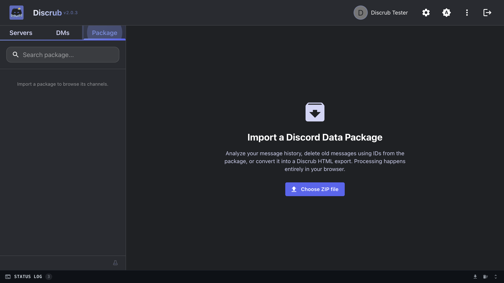

**Analytics on your full message history.** Per-server and per-channel counts, channel-type breakdown, and an optional timeline view (monthly activity + hour-of-day patterns).

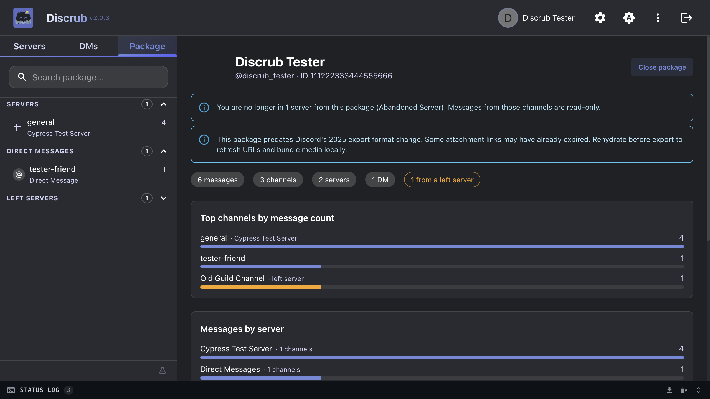

**Browse the messages.** Imports decompress once into IndexedDB; per-channel reads come straight from IDB on demand and never re-decompress the ZIP. Reload the page and the package auto-resumes without a re-import. Discord-style message formatting with markdown, mention chips, custom emoji, and auto-linked URLs. Attachment placeholders preserve the original CDN URL. Older packages with unquoted snowflake IDs survive parsing without precision loss across user, server, channel, and message metadata.

**Filter package messages.** A Filter button above the package message table opens a focused FilterModal with Content and Date controls, applying a client-side predicate so you can narrow the list to matches without touching the network. The header shows the filtered count above the total, and exports honor whatever filter is currently active. After enriching a channel via "Load rich data", reaction emoji chips also become clickable, opening the live ReactionModal so you can see who reacted (when a Discord token is available; without one the modal shows "User list not available").

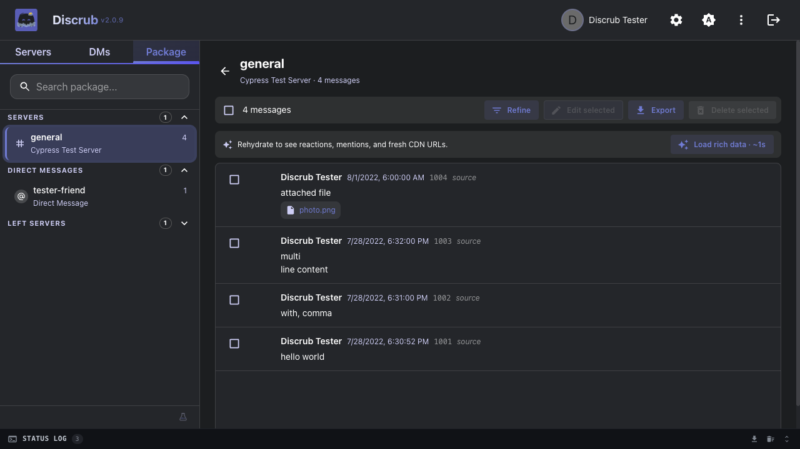

**Tier 2 rehydration (opt-in, per channel).** Click "Load rich data" to fetch live `Message` objects from Discord: real reactions, reply quotes, named mentions, embeds, stickers, and fresh signed CDN URLs for attachments. The button surfaces an estimated runtime on hover (X messages, expected duration) so multi-hour rehydrates don't start without warning. A guild-wide search preflight covers most messages in a single pass before per-message lookups begin; the status log shows how many of the package's messages were served by that scan. Results persist to IndexedDB so enriched channels load instantly on return. Pause/resume/cancel work the same as every other long-running operation; partial results are saved on cancel.

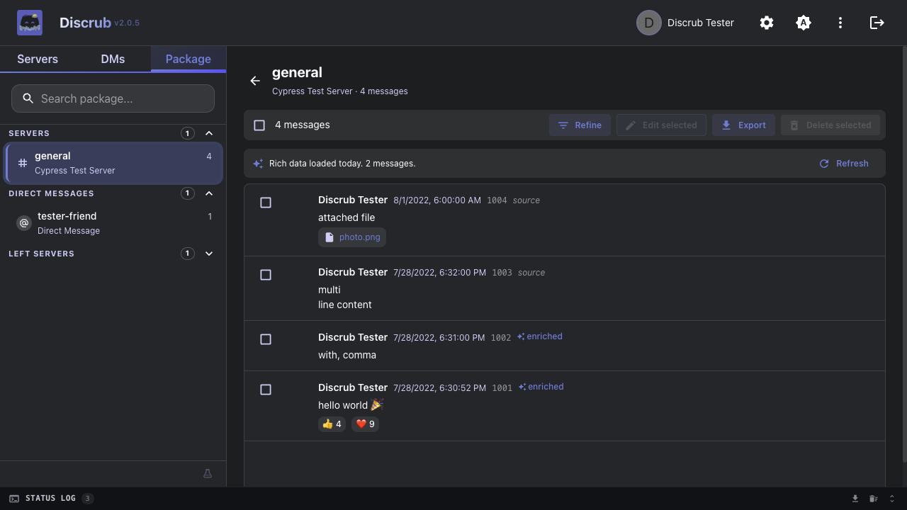

Exports work identically to live exports (same dialog, all presets, all templates) and prefer the enriched `Message` objects when available. A "Rehydrate before export" toggle triggers enrichment just-in-time if the channel hasn't been rehydrated yet.

### Settings & Preferences

Comprehensive settings across multiple tabs:

- **Display**: date and time format, DM list ordering (most recent first, alphabetical, or Discord's own order)
- **User Data**: display name and nickname lookup toggles, reaction enrichment, user data refresh rate
- **Operation Delays**: configurable search and delete delays with randomization modifier (with a built-in `?` explainer covering Discord rate limits)
- **Export Preferences**: default format, template, media types, and all export options
- **Purge Behavior**: default mode (Delete, Strip Attachments Only, Remove Reactions) and media retention

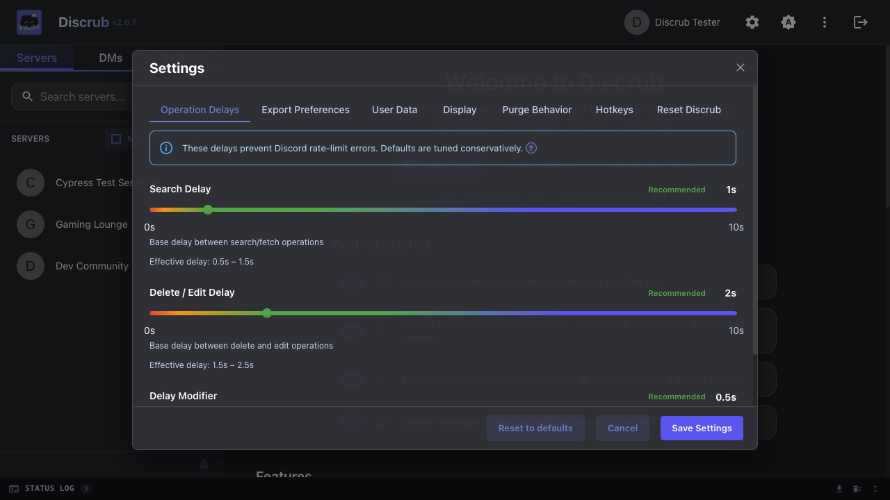

### Status Log

Terminal-style operation log with color-coded entries ([INFO], [OK], [ERR], [WARN], [SESSION]), real-time progress tracking, downloadable log file, and smooth expand/collapse animation. Auto-scrolls to latest entries on open. The panel is **resizable**: drag the top edge to give long-running operations more vertical room. History persists across sessions and groups by session for easy review.

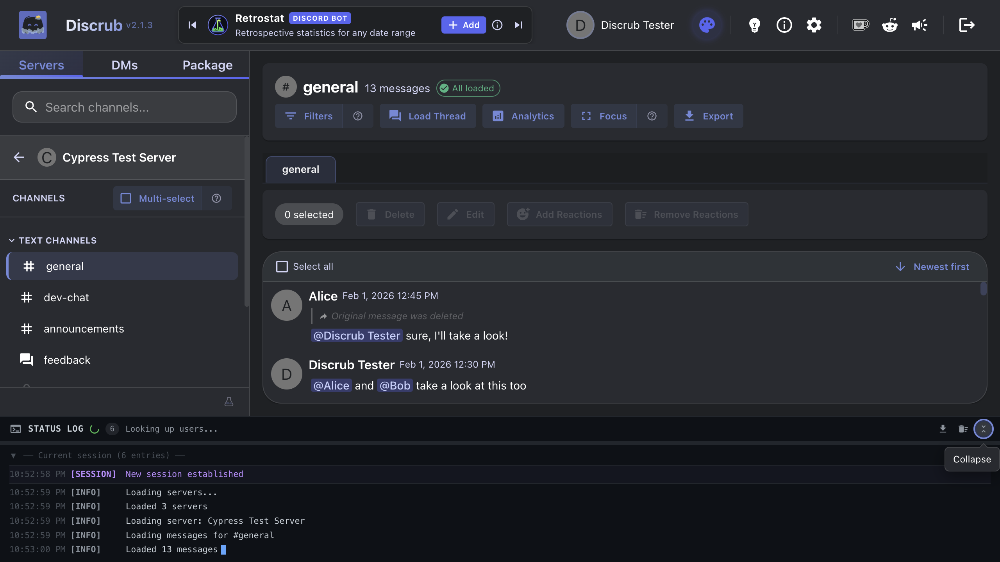

### Pause, Resume & Cancel

All long-running operations (export, purge, load all, delete, edit, reaction removal) support:
- **Pause**: temporarily halt the operation
- **Resume**: continue from where you left off
- **Cancel**: abort the operation

Controls appear in the status bar whenever an operation is running. In Focus Mode (or anywhere the status panel is hidden), a floating pause control appears during heavy operations so pausing is always within reach, and the `Space` hotkey keeps working.

A dropped connection doesn't end a run. Exports, purge scans, thread Load All and package rehydration retry a failed page fetch with backoff (network errors and server 5xx only; a 4xx is final). Exports and Load All pause when the retries run out so you can fix the network and Resume from the same page; a purge scan that still can't continue says so in the status log instead of finishing as if it had covered everything.

### Themes

Pick a look from the theme picker in Settings, with a live preview as you hover. Six themes are free: Dark Original (the default), Light Original, Terminal, High Contrast, Overcast, and Classic. The picker also follows your system preference if you'd rather switch automatically.

Supporters unlock eight more cosmetic themes (AMOLED Void, Synthwave, Bytecraft, Ember, Nekonoir, Circuit, Noir, Abyss), plus a matching theme switcher in HTML exports and a customizable export footer. Open the palette icon in the top bar to see the Themes hub and paste the key from your Ko-fi email. Every Discrub feature stays free; supporter perks are cosmetic only.


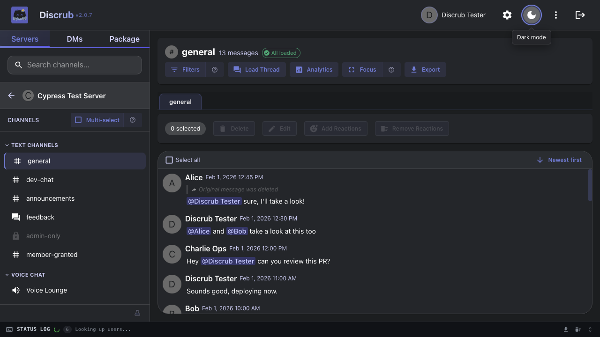

### Additional Features

- **Donation Wall**: Ko-Fi supporter feed with tier system and leaderboard
- **Ideas & Contact**: direct links to email and GitHub issues
- **Announcements**: in-app announcements rendered from GitHub-hosted markdown, with a version-aware re-trigger so users see fresh announcements once, plus a rail of every previous announcement in the same dialog
- **From the Discrub team**: a corkboard on the welcome screen with the studio's Discord bots (Retrostat first) and a note from the developer
- **Role Colors & Icons**: author names colored by highest-position role, with role icons next to author names in the feed and user profiles
- **Copy to Clipboard**: copy server, channel, or DM lists
- **Reset Discrub Data**: escape hatch in Settings that wipes Discrub's local IndexedDB databases, useful for recovering from corrupted state without uninstalling the extension
- **Error Logging**: persistent error log with download capability
- **Tab Close Protection**: warns when closing tab during active operations

---

## Web App vs Extension

| Feature | Web App | Extension (Chrome / Firefox) |
|---------|---------|-----------|
| Authentication | Manual token entry | Auto-retrieves from Discord |
| "Other files" media type | Not available | Available |
| Overlay on Discord | No | Yes (iframe overlay) |
| Minimize to floating tab | No | Yes |
| Settings storage | localStorage | Browser extension storage |
| Installation | None (visit URL) | Install from Web Store / Add-ons |
| Auto-update | Always latest | Browser auto-updates |
| Discrub Classic | Not available | Built-in (select from the launcher splash screen) |

### What differs by setup

Purging, searching and bulk operations behave the same everywhere. Three things differ (the app shows this table under the **Compatibility** info button):

| | Chrome extension | Firefox extension | Bleeding Edge on Chrome | Bleeding Edge on Firefox | Bleeding Edge on mobile |
|---|---|---|---|---|---|
| Sign in | Automatic | Automatic | Manual | Manual | Manual |
| Export size | No limit | Smaller parts | No limit | No limit | Smaller parts |
| Export media | All files | All files | Most files | Most files | Most files |

"Manual" means you paste your Discord token each visit, or tick "Keep me logged in" to keep it in that browser (the extension reads it for you). "Smaller parts" means each zip part is held in memory before it downloads (Firefox extension pages have no service worker; iOS stages through Safari's storage quota), so those setups default to 500 MB parts under Export settings → Max zip size. "Most files" means the hosted build fetches media through Discord's proxy, which refuses a few formats; skipped files are listed in the status log and the messages themselves are always complete.

Both versions use the same codebase and make identical API calls from your browser. The extension includes Discrub Classic (the original interface) as a built-in option: when you first launch Discrub, a splash screen lets you choose between Discrub 2.0 and Discrub Classic. Your choice is remembered for future sessions.

---

## Getting Started

### Web App

1. Visit the hosted Discrub app
2. Get your Discord token:
   - Open Discord in your browser
   - Press `F12` to open DevTools
   - Go to the **Network** tab
   - Click on any request to `discord.com/api`
   - Find the `Authorization` header value; that's your token
3. Paste your token on the Discrub landing page
4. Browse your servers and start exporting!

### Finding your Discord token

The web app and the hosted Bleeding Edge build sign in with your Discord user token, which you paste in yourself (the extension picks it up for you). To find it:

1. Open [discord.com/app](https://discord.com/app) in your browser and log in.
2. Open DevTools (`F12`, or `Cmd+Option+I` on a Mac) and switch to the **Network** tab.
3. Click any server or channel so Discord makes a request, then pick a request whose name starts with `messages`, `channels`, or `science` from the list.
4. In the request's **Headers** panel, scroll to **Request Headers** and copy the value of `authorization`. That long string is your token.
5. Paste it into Discrub's token field. Discrub keeps it in memory only and never writes it to disk, unless you tick **Keep me logged in** (web app only). That stores the token as plain text in your browser's site data until you log out, so only use it on a device you control.

Treat the token like a password: anyone holding it can act as your account. Never share it or paste it anywhere you do not trust. Logging out of Discord (or changing your password) invalidates it, so you will need a fresh one afterwards.

### Extension (Chrome)

1. Install from the [official Chrome Web Store listing](https://chromewebstore.google.com/detail/plhdclenpaecffbcefjmpkkbdpkmhhbj) (or [load manually](#still-prefer-discrub-classic))
2. Navigate to [discord.com](https://discord.com)
3. Click the Discrub icon on the page; a launcher splash screen appears
4. Choose **Discrub 2.0** (modern interface) or **Discrub Classic** (original interface)
5. Discrub auto-retrieves your Discord token and loads the selected version

### Extension (Firefox)

1. Install from the [official Firefox Add-ons listing](https://addons.mozilla.org/firefox/addon/discrub/) (or [load manually](#still-prefer-discrub-classic))
2. Navigate to [discord.com](https://discord.com)
3. Same launcher and auto-authentication as Chrome

---

## Upgrading from Discrub Classic

If you're coming from Discrub Classic, see the [Onboarding Guide](ONBOARDING.md) for a detailed walkthrough of what's new, what's changed, and how to get the most out of the new version.

### Still prefer Discrub Classic?

You can manually install the legacy extension from the [releases page](https://github.com/pratherbytecraft/discrub-ext/releases):

**Chrome:**
1. Download the latest Chrome `.zip` from [Releases](https://github.com/pratherbytecraft/discrub-ext/releases)
2. Extract the ZIP file
3. Open Chrome and navigate to `chrome://extensions`
4. Enable **Developer mode** (toggle in the top-right corner)
5. Click **Load unpacked**
6. Select the extracted folder
7. Navigate to [discord.com](https://discord.com); the Discrub Classic overlay appears

**Firefox:**
1. Download the latest Firefox `.zip` from [Releases](https://github.com/pratherbytecraft/discrub-ext/releases)
2. Extract the ZIP file
3. Open Firefox and navigate to `about:debugging#/runtime/this-firefox`
4. Click **Load Temporary Add-on**
5. Select any file inside the extracted folder (e.g., `manifest.json`)
6. Navigate to [discord.com](https://discord.com); the Discrub Classic overlay appears

> Firefox temporary add-ons are removed when the browser closes. For persistent installation, the add-on must be signed or installed from Firefox Add-ons.

---

## Development

Build and tooling notes for project development and source-level review.
Official Discrub distributions are the Chrome Web Store and Firefox Add-ons
listings; see [Getting Started](#getting-started).

### Prerequisites

- Node.js 18+
- npm

### Install Dependencies

```bash
npm install --legacy-peer-deps
```

> The `--legacy-peer-deps` flag is required due to a date-fns peer dependency conflict.

### Development Server

```bash
npm run dev
```

Opens at `http://localhost:3000`. Set `VITE_DISCORD_TOKEN` in a `.env` file for auto-authentication during development.

### Production Build

```bash
npm run build
```

Output in `dist/`.

### Extension Build

```bash
# Chrome
npm run build:extension:chrome

# Firefox
npm run build:extension:firefox

# Both
npm run build:extension
```

### Run Tests

```bash
# Unit tests (Vitest)
npm test

# E2E tests (Cypress; requires a running dev server)
npm run cy:run

# Cross-browser E2E
npm run cy:run:cross-browser

# Storybook
npm run storybook
```

### Regenerate Documentation Screenshots

```bash
npm run demo:screenshots
```

Runs the demo Cypress spec and copies screenshots to `docs/screenshots/`.

---

## FAQ

### Is Discrub safe to use?

Yes. Discrub runs entirely in your browser; your Discord token never leaves your device. There is no backend server, no data collection, no analytics. All Discord API calls originate from your browser's IP address, the same as if you were using Discord directly.

### Will I get rate limited?

Discrub includes configurable delays between API calls (default: 1s search, 2s delete) with randomization to avoid patterns. If Discord does rate limit you (HTTP 429), Discrub automatically waits the required `retry_after` duration before retrying. You can adjust delays in Settings > Operation Delays. Search and delete delays go up to 30s; anything above 10s is marked Safest and is meant for very long runs such as a full-server export.

### What about Discord's Terms of Service?

Discrub uses your own user token to access data you already have permission to see. It does not automate account creation, mass-DM, spam, or any abusive behavior. It's a data management tool for your own account.

### Why not use a bot instead?

Bots require server admin permissions to be added, and they use a different authentication flow. Discrub works with your personal user token, giving you access to everything you can already see, including DMs, which bots cannot access.

### Can I export DMs?

Yes. Switch to the DMs tab, select a conversation, and export like any channel.

### What's the difference between Standard and Discord Layout templates?

**Discord Layout** (default) wraps the export in a Discord-like interface with a server sidebar, channel navigation, and theme toggle, ideal for bulk exports where you want to browse between channels. **Standard** produces clean, standalone HTML pages without the shell wrapper.

### Why can't I see some channels?

Channels you lack permission to view are shown with a lock icon and dimmed appearance. This is based on your Discord permissions (role-based, with channel-specific overwrite support). Admin users see all channels.

### Can I export media and attachments?

Yes. In the export dialog, expand "Files & Media" to enable media download. You can toggle individual types (images, videos, audio). Media is downloaded from Discord's CDN and included in the export ZIP.

> The "Other files" type (PDFs, ZIPs, etc.) is only available in extension mode due to browser CORS restrictions on non-media file downloads.

### Is there a message limit?

No practical limit. Discord's search API returns up to 5,000 results per query, but Discrub automatically continues past this boundary by adjusting the search window. The "Load All" feature uses cursor-based pagination with no limit. You can export or purge entire channels regardless of size.

### Can I purge other users' messages or reactions?

Purging other users' messages requires the **Manage Messages** permission in that channel. Without it, you can only delete your own messages. The same applies to reactions: you can always remove your own reactions, but removing others' requires Manage Messages.

### How do I pause or cancel an operation?

When any operation is running (export, purge, delete, etc.), pause and cancel buttons appear in the status bar at the bottom of the screen. Pausing suspends the operation; you can resume or cancel from there.

### Does Discrub support forum channels?

Yes. Forum channels (and media channels) are fully supported. Discrub discovers active and archived threads (public and private), displays them in a thread list view, and exports each thread's messages individually.

### What happens if I close the tab during an export?

Discrub shows a browser warning before closing the tab during any active operation. If you dismiss the warning and close anyway, the operation is lost and any partial export data is discarded.

### Can multiple people use Discrub on the same server?

Yes. Each user runs Discrub independently in their own browser with their own token. There's no shared state, no server-side component, and no interference between users. Rate limits apply per-user.

### How do I report bugs or request features?

Use the Ideas & Contact button (the lightbulb in the top bar) to reach support@pratherbytecraft.com, GitHub issues, or Ko-fi commissions. On wide windows the Supporter Wall, r/discrub and the latest announcement also sit right on the top bar; on narrow ones they fold into the More menu.

### How do I update Discrub?

- **Web app:** Always serves the latest version; refresh the page
- **Extension:** Chrome and Firefox auto-update extensions. For manual installs, re-download from the releases page

### Does Discrub work offline?

No. Discrub requires an active internet connection to communicate with Discord's API. However, exported files (HTML, CSV, JSON) work fully offline once downloaded.

### What browsers are supported?

Discrub works in any modern browser (Chrome, Firefox, Edge, Brave, Safari). The extension is available for Chrome and Firefox. E2E tests are run against both Chrome and Firefox.

### What is the "Other files" media type?

This refers to non-media attachments like PDFs, ZIP files, documents, etc. Due to browser CORS restrictions, these can only be downloaded in extension mode (where the extension has permission to fetch from any origin). In web app mode, only images, videos, and audio are downloadable.

### How are role colors determined?

Discrub displays author names in the color of their highest-position role that has a non-zero color, the same logic Discord uses. Role icons (custom images or unicode emojis) from the highest-position role are also shown next to author names.

---

## Tech Stack

- **React 18** + **TypeScript** + **Vite**
- **Redux Toolkit** for state management
- **Material UI (MUI)** for components
- **discrub-core** for Discord API communication
- **Vitest** for unit testing (4000+ tests)
- **Cypress** for E2E testing (740+ tests across 41 specs)
- **Storybook** for component development (35 stories)

---

## Security

Worried your copy was tampered with, or found something to report? See
[SECURITY.md](SECURITY.md); it lists the only official store URLs, the extension's
full permission set, and step-by-step recipes to verify a downloaded package against
published SHA-256 checksums (`store/SHA256SUMS.txt`, `scripts/verify-extension.mjs`).

---

## License

All rights reserved. © 2026 Prather Bytecraft.

The source code in this repository is publicly visible for transparency and
security review. Discrub is officially distributed via the Chrome Web Store and
Firefox Add-ons; those are the supported ways to use it.

"Discrub" and the Discrub logo are trademarks of Prather Bytecraft and may not be used
in derivative or competing works.

---

Want something built? Sponsor a feature or commission a theme through [Ko-fi Commissions](https://ko-fi.com/prathercc/commissions), or write to workbench@pratherbytecraft.com about a Discord bot of your own.

Built by [Prather Bytecraft](https://github.com/pratherbytecraft) · [pratherbytecraft.com](https://pratherbytecraft.com)
